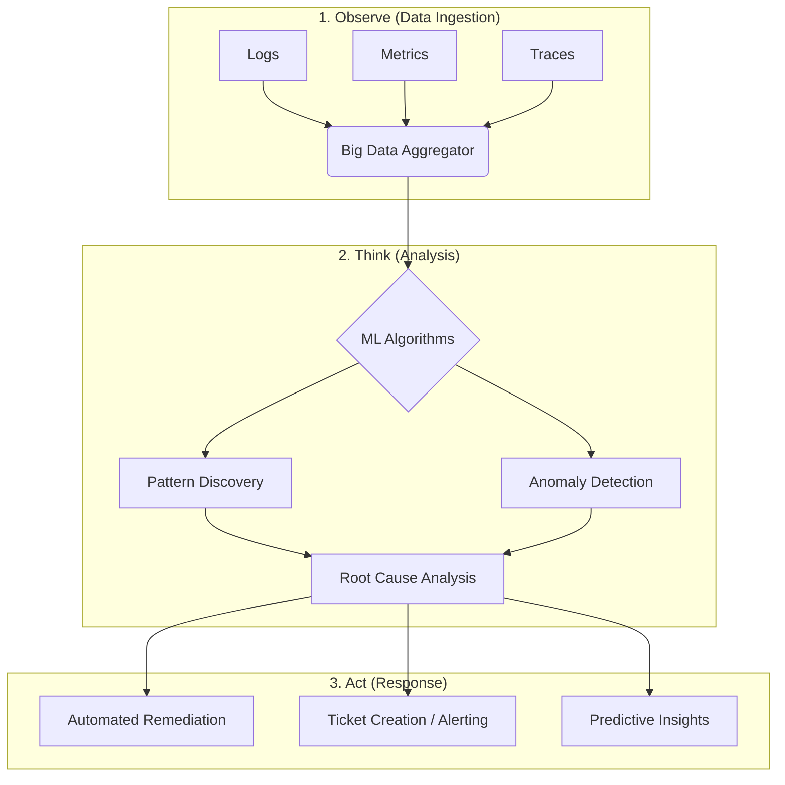
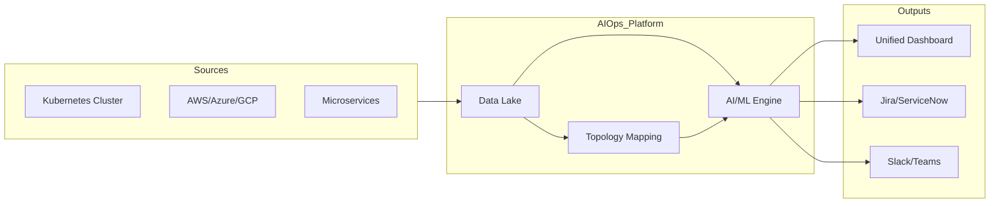

# AIOps: Artificial Intelligence for IT Operations

Welcome to the **AIOps Fundamentals** module. This repository contains resources and documentation to understand how Artificial Intelligence and Machine Learning are transforming IT Operations.

## What is AIOps?

**AIOps** stands for **Artificial Intelligence for IT Operations**. It combines big data and machine learning to automate IT operations processes, including event correlation, anomaly detection, and causality determination.

In simpler terms: It uses smart algorithms to filter out the noise from your IT data and fix problems faster than humans can.

---

## The AIOps Workflow

The following diagram illustrates the high-level workflow of an AIOps platform, moving from raw data collection to automated resolution.

---

## Key Pillars of AIOps

AIOps is generally built upon three core pillars:

### 1. Observe (Big Data)

Modern IT environments generate massive amounts of data. AIOps tools ingest this data in real-time.

* **Historical Data:** For training models.
* **Streaming Data:** For real-time analysis.
* **Data Types:** Log files, packet data, APIs, and metrics.

### 2. Think (Machine Learning)

This is the "Brain" of the operation.

* **Pattern Matching:** Identifying known error signatures.
* **Anomaly Detection:** flagging behavior that deviates from the "normal" baseline (e.g., a CPU spike at 3 AM).
* **Correlation:** Grouping related alerts (e.g., "Database Down" and "Web App Error") into a single incident.

### 3. Act (Automation)

The final goal is to reduce manual toil.

* **Auto-Remediation:** Restarting servers or scaling pods automatically.
* **Smart Routing:** Sending the ticket directly to the Database Team instead of a general helpdesk.

---

## AIOps vs. Traditional Monitoring

| Feature | Traditional Monitoring | AIOps |
| --- | --- | --- |
| **Data Analysis** | Static Thresholds (If CPU > 80%) | Dynamic Baselines (If CPU behavior is unusual) |
| **Alert Volume** | High (Alert Storms) | Low (Correlated Incidents) |
| **Response** | Reactive (Fix it when it breaks) | Predictive (Fix it before it breaks) |
| **Scope** | Siloed (Network vs. App) | Holistic (Full Stack Observability) |

---

## Common Use Cases

### Root Cause Analysis (RCA)

Instead of hunting through 50 different log files, AIOps pinpoints the exact change or error that caused the outage.

### Noise Reduction

AIOps filters out "false positives" and non-actionable alerts, allowing engineers to focus on critical severity issues.

### Predictive Maintenance

Analyzing trends to predict when a disk will fill up or when memory will be exhausted, allowing teams to intervene days in advance.

---

## Architecture Diagram

A more detailed look at how AIOps integrates into the DevOps ecosystem:

---

## Resources for Learning

* **Tools to explore:** Dynatrace, Datadog Watchdog, Splunk ITSI, Moogsoft.
* **Concepts:** Machine Learning, DevOps, SRE (Site Reliability Engineering).

---

### How to use this in your Repo:

1. Create a file named `README.md` (or `AIOps-Intro.md`).
2. Paste the content above into the file.
3. **Note:** GitHub supports Mermaid diagrams natively in Markdown files. The code blocks marked with `mermaid` will automatically render as diagrams when viewed on GitHub.

Would you like me to generate a specific "Lab Exercise" section for this repo where students can try a simple AIOps task?
