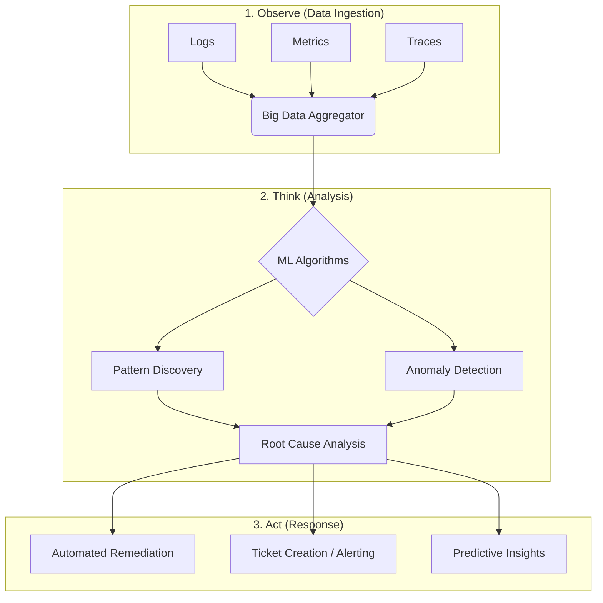
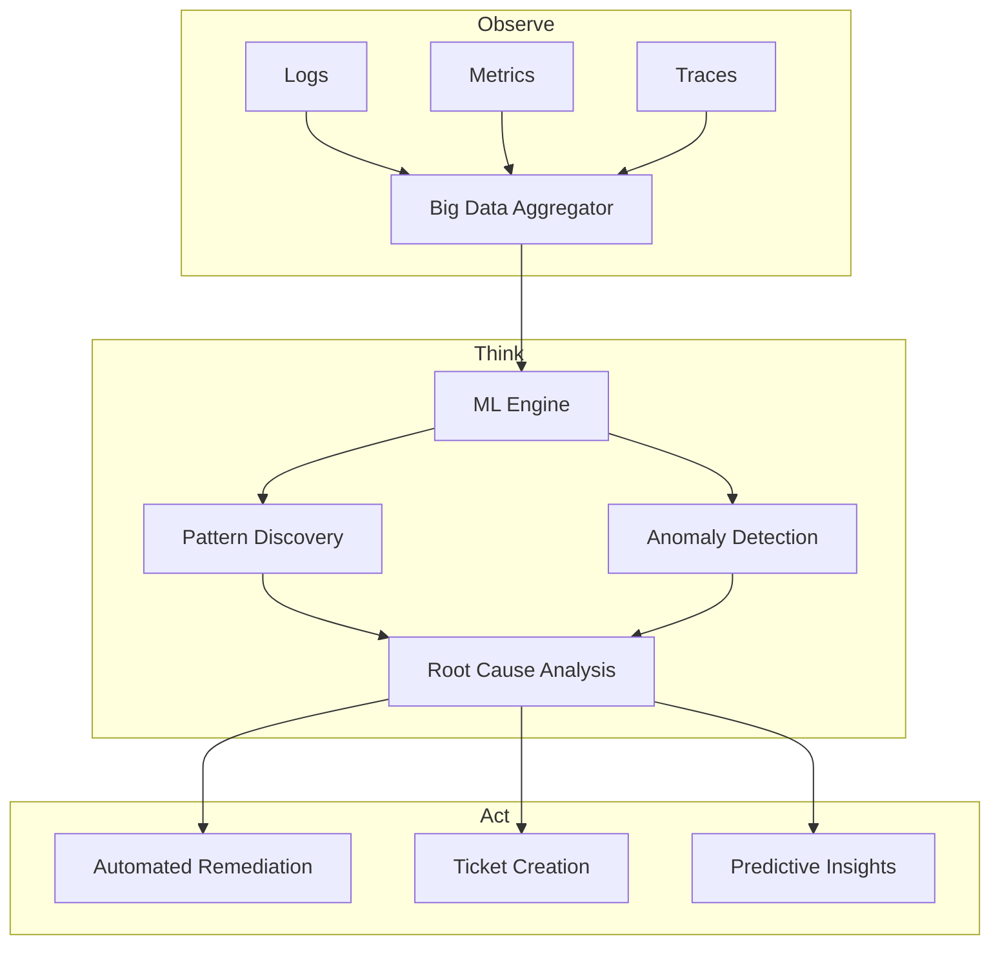
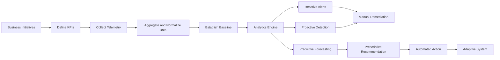
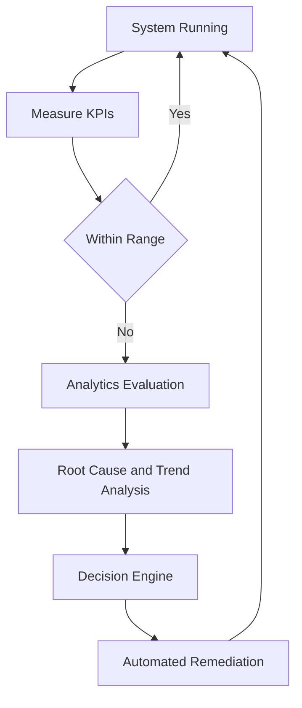
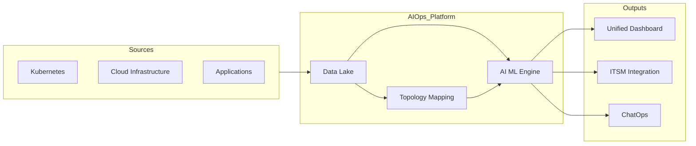

# AIOps – Introduction

# 1. What is AIOps

**AIOps (Artificial Intelligence for IT Operations)** is the discipline of applying analytics, machine learning, and automation to IT operations.

It combines:

* `Big data` + `Machine learning` + `Observability` + `Automation`

To automate:

* Event correlation
* Anomaly detection
* Root cause analysis
* Predictive forecasting
* Remediation workflows

Unlike traditional operational models that focus on building and deploying systems, AIOps focuses on:

* Observability
* Measurement
* Trend analysis
* Predictive intelligence
* Automated remediation

### Core Operating Model

AIOps works **outside-in**:

Business Objective → Define KPIs → Measure → Analyze → Automate

It filters operational noise and converts telemetry into intelligent decisions.

## The AIOps Workflow

The following diagram illustrates the high-level workflow of an AIOps platform, moving from raw data collection to automated resolution.

---

# 2. DevOps vs MLOps vs AIOps

## DevOps

Focus: Application delivery lifecycle
Concern: Build → Test → Deploy → CI/CD
Nature: Workflow-centric

Optimizes how systems are built.

---

## MLOps

Focus: ML lifecycle
Concern: Data → Train → Validate → Deploy → Monitor model
Nature: Model-centric

Optimizes how ML systems are trained and deployed.

---

## AIOps

Focus: System behavior + business impact
Concern: KPI monitoring, anomaly detection, predictive analytics, automation
Nature: Outcome-centric

Optimizes how systems behave in production.

---

# 3. Core Philosophy of AIOps

Before implementing tools:

* Define business objectives
* Identify critical outcomes
* Define acceptable performance levels

Without business alignment, monitoring produces noise instead of intelligence.

---

# 4. Key Terminology

## KPI – Key Performance Indicator

A measurable value indicating whether a business objective is being met.

Examples:

* API latency < 200ms
* 99.9% availability
* ML inference error rate < 2%
* Transaction success rate > 98%

KPIs define the tolerable operating range.

KPI degradation = business risk.

---

## Observability

Ability to understand system state using:

* Logs
* Metrics
* Traces
* Events

---

## Baseline

A known healthy system behavior pattern.
Used to detect anomalies.

---

## Reactive

Respond after KPI breach.

---

## Proactive

Detect warning signals before breach.

---

## Predictive

Forecast future failure using trends and models.

---

## Prescriptive

System recommends corrective action.

---

## Automation

System executes corrective action autonomously.

---

# 5. The Three Pillars of AIOps

## 1. Observe (Data Ingestion Layer)

Modern environments generate massive telemetry.

Data types:

* Logs
* Metrics
* Traces
* Events
* API data
* Infrastructure state

Data categories:

* Historical data (model training)
* Streaming data (real-time analysis)

This layer builds visibility.

---

## 2. Think (Machine Learning and Analytics Layer)

This is the intelligence engine.

Capabilities:

* Pattern matching (known error signatures)
* Anomaly detection (deviation from baseline)
* Correlation (group related alerts into one incident)
* Root cause analysis
* Forecasting
* Trend modeling

This transforms raw telemetry into operational insight.

---

## 3. Act (Automation Layer)

The objective is reducing manual toil.

Capabilities:

* Auto-remediation (restart service, scale pods)
* Smart ticket routing
* Alert prioritization
* Predictive alerts
* Self-healing workflows

This transforms insight into execution.

---

# 6. High-Level AIOps Workflow

---

# 7. AIOps Workflow Roadmap (Implementation Order)

## Phase 1 – Business Alignment

Define objectives → Identify KPIs

## Phase 2 – Data Collection

Enable logs, metrics, traces
Centralize telemetry

## Phase 3 – Baseline Establishment

Define healthy system behavior

## Phase 4 – Analytics Implementation

Trend analysis
Anomaly detection
Forecasting models

## Phase 5 – Automation

Alerting
Auto-remediation
Self-healing systems

---

# 8. Maturity Progression Model

AIOps evolves through stages:

1. Reactive
2. Proactive
3. Predictive
4. Prescriptive
5. Autonomous Automation

Goal: adaptive, self-adjusting systems.

---

# 9. AIOps vs Traditional Monitoring

| Feature       | Traditional Monitoring | AIOps                |
| ------------- | ---------------------- | -------------------- |
| Data Analysis | Static thresholds      | Dynamic baselines    |
| Alert Volume  | High alert storms      | Correlated incidents |
| Response      | Reactive               | Predictive           |
| Scope         | Siloed                 | Full-stack holistic  |

Traditional model:
If CPU > 80% → Alert

AIOps model:
If CPU behavior deviates from normal pattern → Intelligent decision

---

# 10. Common Use Cases

## Root Cause Analysis

Automatically identifies the triggering change or error among thousands of events.

---

## Noise Reduction

Reduces false positives and alert storms by correlating related events.

---

## Predictive Maintenance

Forecasts:

* Disk exhaustion
* Memory leaks
* Capacity issues
* Traffic spikes

Intervention occurs before failure.

---

# 11. End-to-End Business-Driven AIOps Flow

---

# 12. Closed-Loop Control Model

---

# 13. Reference Architecture

---

# 14. Tooling Ecosystem

Common categories:

* Container platforms (Docker, Kubernetes)
* Infrastructure as Code (Terraform)
* Logging systems
* Monitoring systems
* ITSM platforms
* Cloud providers

These generate telemetry that fuels AIOps engines.

---

# 15. Final Structured Definition

AIOps is a business-aligned, analytics-driven operational framework that:

* Defines measurable success through KPIs
* Continuously observes systems
* Detects deviations
* Forecasts future risk
* Prescribes corrective decisions
* Automates remediation

It transforms IT from reactive incident response into adaptive autonomous operations.
